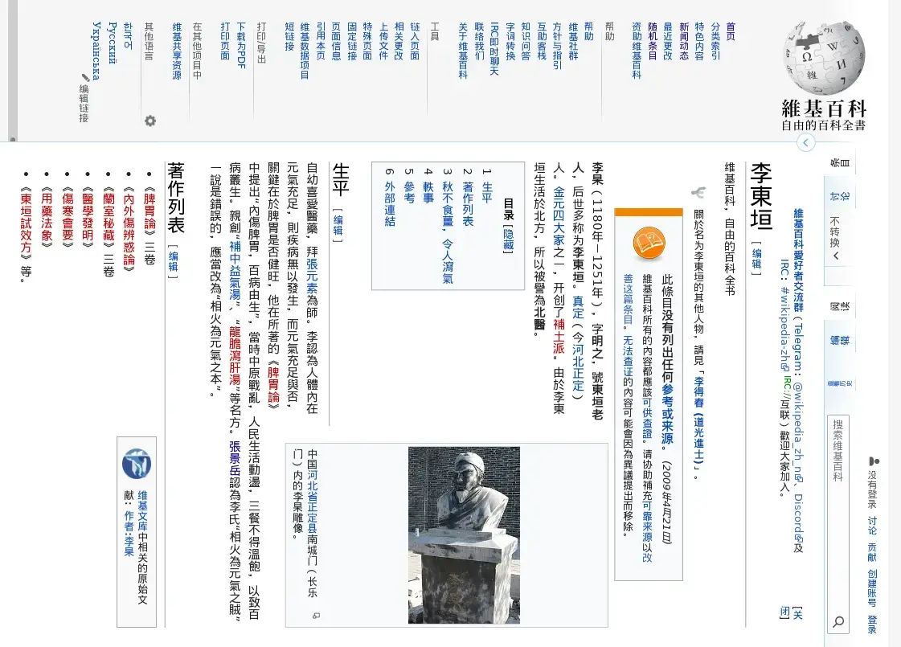

将网页显示成 如 亚洲中华文化圈 传统书写方式 那样的 竖排排版。

Make webs render in vertical lined layout, like traditional CJK writing method in east asian culture circle.

## 使用

1. 安装
   - [AMO Firefox Addon](https://addons.mozilla.org/firefox/addon/vertical-ize-cjk-lines/)
   - 在Firefox/Chrome的addon dev模式中load进去
2. 打开一个网页
3. 点工具栏上的按钮，开始竖排阅读
4. 使用`鼠标滚轮`右左滚动，使用`shift+鼠标滚轮`上下滚动
5. 有新内容通过ajax加载，或导航至新页面后，可再点工具栏按钮

> Use on your own risk!

## 效果及兼容性

网页兼容性约85%。文字选择可用。可缩放

原网页的js建立的交互性、链接点击、表单提交有极少量的损失（因`<iframe>` 及其 sandbox）

这个项目目前位于poc阶段



更多截图见`screenshots/`

## 原理

> 也欢迎开issue探讨

### 当前方案

简要描述：

1. 使用`<iframe>`装载原网页

2. 使用CSS`transform`的`rotate`把整个`<iframe>`旋转

3. 使用已旋转过CJK的自定义字体
   
   > 目前是FontForge中乱炖一通出来的。不懂字体，欢迎指正

4. 旋转图片

### 其他方案

尝试过和想过其他方案。有些失败。欢迎探讨

#### 正经方案

- 让浏览器原生支持。等个大神出现改Firefox/Chromium源代码。若w3c定个标准我们就完成任务了

- 使用CSS现有的[`writing-mode: vertical-rl`](https://developer.mozilla.org/en-US/docs/Web/CSS/writing-mode)（支持不全）。但这需要整个网页开始设计时就考虑

#### 不正经方案

- 使用旋转CJK的字体和旋转图片后，用canvas或Headless browser等方案对原网页进行实时截图，然后旋转展示截到的图给用户。
  
  这样可以避免影响原网页自身建立的交互js，但鼠标如何与内容交互需要一个方案

- 避免使用自己的ttf：
  
  遍历每个文本节点，把每个CJK加`<span>`后单独旋转

- 在Firefox的Browser Toolbox（非web toolbox）中将
  
  ```
  html#main-window body hbox#browser vbox#appcontent tabbox#tabbrowser-tabbox tabpanels#tabbrowser-tabpanels.plain hbox#panel-1-92.browserSidebarContainer vbox.browserContainer stack.browserStack browser
  ```
  
  旋转。失败，Firefox崩溃

- 旋转屏幕，系统有这种设置。有些Linux WM据说可以旋转一个窗口

## 其他竖排阅读软件

- Vivaldi的阅读模式支持竖排

移动端支持字定义字体，且支持竖排阅读的APP：

- [静读天下](https://www.moondownload.com/chinese.html)

- [讀書尚友](https://play.google.com/store/apps/details?id=info.ebstudio.bookviewer.free) by 青空文庫ビューア （[官网](http://ebstudio.info)）。支持[iOS](https://apps.apple.com/jp/app/id1579254502)

> 欢迎补充

## 其他传统中华文字相关项目

- 篆书字体收集
  
  [GitHub - garywill/cc-visualize at resource](https://github.com/garywill/cc-visualize/tree/resource)

- [全文繁简字对应关系可视化工具](https://github.com/garywill/cc-visualize)

- [**大术专搜**](https://github.com/garywill/BigSearch/blob/master/src/README_zh.md)（一个搜索、查询工具）中收集的汉语工具部分

## 玩而后赏

子曰，玩而予赏，善莫大焉？<br>
又曰，玩而不赏，良心安焉？<br>
老夫谢过！<br>
<a target="_blank" href="https://github.com/garywill/receiving/blob/master/receiving_methods.md"></a><br>
虽然，小小玩意，不足挂齿；<br>
亦是，卅年老刀，献丑于此。<br>
其实，多赏非求，少许亦可。<br>
进者，[参观主页](https://garywill.github.io)，玩物更多。
